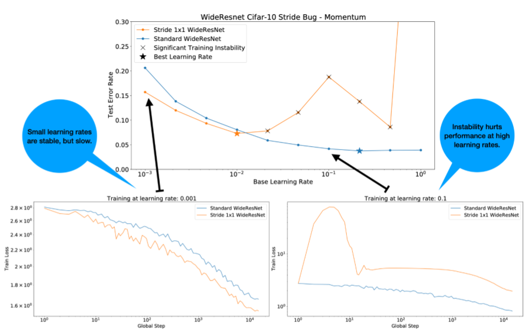
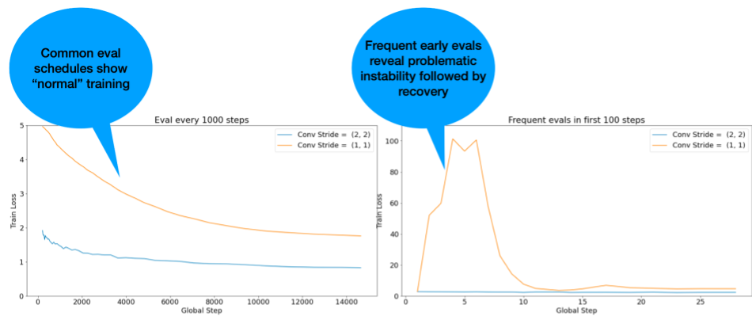
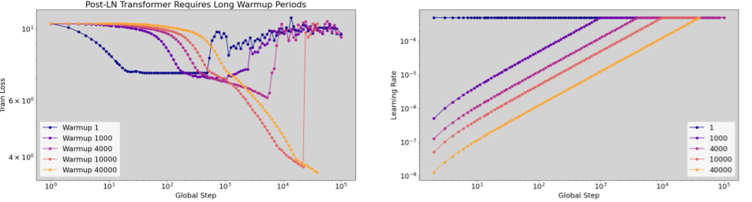
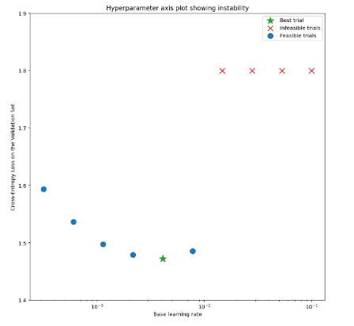
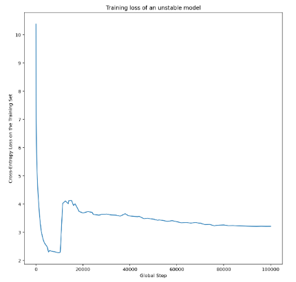
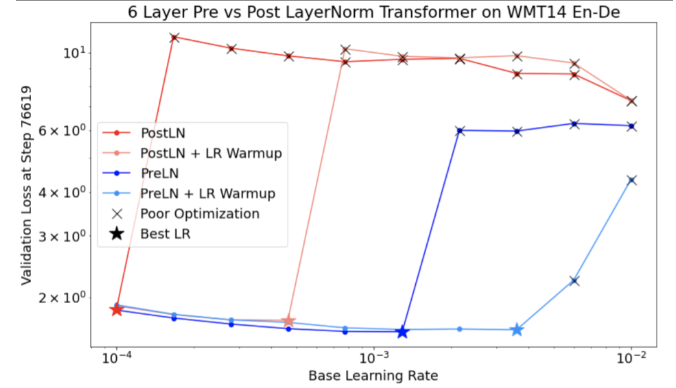
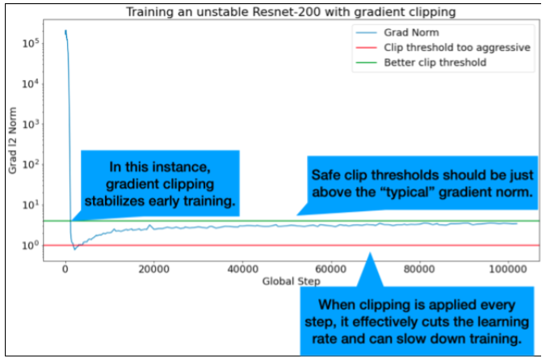

# 5. FQA

## What is the best learning rate decay schedule family?

1. 这是个开放的问题。目前还不清楚如何构建一组严格的实验来自信地回答“最佳”LR衰变时间表是什么。
2. 虽然我们不知道最好的`learning rate decay schedule family`是什么，但我们相信有一些（非恒定的）时间表是很重要的，并且调整它很重要。
3. 在优化过程中，不同的学习率在不同的时间效果最佳。有了某种时间表，模型更有可能达到良好的学习率。

## Which learning rate decay should I use as a default?

1. 我们的偏好是线性衰减(`linear decay`)或余弦衰减(`cosine decay`)，其他一些计划族可能也很好。

## Why do some papers have complicated learning rate schedules?(为什么有些论文有复杂的学习进度表)

1. 具有复杂的分段学习率（LR）衰减时间表的论文并不少见。
2. 读者常常想知道，作者在试验研究中是如何得出如此复杂的`learning rate schedules`
3. 许多复杂的LR衰减计划是以特殊方式根据验证集性能调整计划的结果：
    - 开始一次简单的LR衰减（或恒定的学习速度）训练。
    - 继续训练，直到表现停滞。如果发生这种情况，暂停训练。从这一点开始，使用可能更陡的LR衰减时间表（或更小的恒定学习速率）恢复它。重复此过程直到会议/发布截止日期。
4. 快速复制生成的计划通常不是一个好主意，因为最佳的特定计划将对大量其他超参数选择敏感
    - 最好复制生成计划的算法，尽管当任意的人类判断生成计划时，这几乎是不可能的。
5. 如果可以完全自动化，则可以使用这种类型的验证错误敏感计划，但作为验证错误函数的人在环计划是脆弱的，不容易重复，因此我们建议避免使用它们。
    - 在发布使用此类计划的结果之前，请尝试使其完全可复制

## &#x1F4CC; How should Adam’s hyperparameters be tuned?

如上所述，关于搜索空间以及应该从搜索空间采样多少点的一般性陈述非常困难。注意，并非Adam中的所有超参数都同等重要。以下经验法则对应于研究中试验次数的不同“预算”。

1. 如果研究中实验次数 < 10 trials，那么仅仅调整 (base) `learning rate`.
2. 如果研究中实验次数在10-25, 调整 `learning rate` 和 $\beta_1$ .
3. 如果研究中实验次数>25, 调整 `learning rate`, $\beta_1$, $\epsilon$  .
4. 如果实验次数远超25次，可以再增加调整 $\beta_2$

## &#x1F4CC; 为什么探索阶段使用准随机搜索而不是更复杂的黑箱优化算法？

1. 准随机搜索（基于低差异序列）是我们对更高级的黑箱优化工具的偏好，当作为迭代优化过程的一部分使用时，旨在最大限度地洞察优化问题（我们称之为“探索阶段”）。贝叶斯优化和类似工具更适合于开发阶段。
2. 基于随机移位的低差异序列的准随机搜索可以被认为是“抖动的、无序的网格搜索”，因为它均匀但随机地探索给定的搜索空间，并且比随机搜索更分散搜索点。
3. 准随机搜索相对于更复杂的黑箱优化工具（例如贝叶斯优化、进化算法）的优势包括：
    1. 对搜索空间进行非自适应采样使得可以在不重新运行实验的情况下改变事后分析中的调整目标。
        - 例如，我们通常希望在训练的任何时候都能找到最佳的验证错误试验。但是，准随机搜索的非自适应性质使得可以在不重新运行任何实验的情况下，基于最终验证误差、训练误差或某些替代评估度量来找到最佳试验
    2. 准随机搜索以一致且统计可重复的方式进行
        - 即使搜索算法的实现发生了变化，只要保持相同的一致性设备，也应该可以重现六个月前的研究。如果使用复杂的贝叶斯优化软件，实现可能会在不同版本之间发生重要变化，从而使重现旧搜索变得更加困难。并非总是可以回滚到旧的实现（例如，如果优化工具作为服务运行）。 
    3. 它对搜索空间的统一探索使人们更容易对搜索结果以及它们可能对搜索空间提出的建议进行推理。
        - 例如，如果准随机搜索遍历中的最佳点位于搜索空间的边界，这是一个很好的（但不是万无一失的）信号，表明搜索空间边界应该改变。然而，自适应黑箱优化算法可能忽略了搜索空间的中间部分，因为即使它恰好包含同样好的点，也会出现一些不吉利的早期试验，因为正是这种不一致性，一个好的优化算法需要使用以加快搜索速度
    4. 与自适应算法不同，当使用准随机搜索（或其他非自适应搜索算法）时，并行与顺序运行不同数量的试验不会产生统计上不同的结果
    5. 更复杂的搜索算法可能并不总是正确处理不可行的点，特别是如果它们的设计没有考虑到神经网络超参数调整。
    6. 准随机搜索很简单，在许多调参试验并行运行时尤其有效
        - 有趣的是，自适应算法很难击败预算为其两倍的准随机搜索，特别是当许多试验需要并行运行时（因此在启动新试验时，很少有机会利用以前的试验结果）。
        - 如果没有贝叶斯优化和其他先进的黑箱优化方法的专业知识，我们可能无法实现它们原则上能够提供的好处。在现实的深度学习调整条件下，很难对高级黑箱优化算法进行基准测试。它们是当前研究的一个非常活跃的领域，而更复杂的算法对于没有经验的用户来说也有自己的陷阱。这些方法的专家能够获得良好的结果，但在高度并行的条件下，搜索空间和预算往往更重要。

也就是说，如果我们的计算资源只允许少量的试验并行运行，并且我们能够承受连续运行许多试验，那么贝叶斯优化变得更有吸引力，尽管我们的调整结果更难解释。

## Where can I find an implementation of quasi-random search?

1. 我们使用这个实现为给定的搜索空间生成Halton序列（旨在实现移位、加扰的Halton序列，如[https://arxiv.org/abs/1706.03200](https://arxiv.org/abs/1706.03200) ).
2. 如果基于低差异序列的准随机搜索算法不可用，则可以替代伪随机均匀搜索，尽管这可能效率稍低。
    - 在1-2个维度上，网格搜索也是可以接受的，尽管在更高的维度上不可行（见[Bergstra&Bengio，2012](https://www.jmlr.org/papers/v13/bergstra12a.html)）。

## How many trials are needed to get good results with quasi-random search?

1. 一般来说，没有办法回答这个问题，但我们可以看看具体的例子。
2. 如图3所示，研究中的试验次数会对结果产生重大影响。
    - 请注意，当6个试验被抽样时，四分位间距有多大，而当20个试验被取样时。
    - 即使进行了20次试验，特别幸运和不幸运的研究之间的差异可能会大于该模型在不同随机种子上的重新训练之间的典型差异，具有固定的超参数，在验证错误率约为23%的情况下，该工作量可能在+/-0.1%左右。

## &#x1F4CC; 如何调试和减轻优化失败？

> 如果模型遇到了优化困难，那么在尝试其他事情之前解决它们很重要。诊断和纠正训练失败是一个活跃的研究领域

在WideResnet中改变单个残差块的strides导致训练不稳定.

Figure 4:在WideResnet中改变单个残差块strides (2x2 -> 1x1) 导致训练不稳定。 这不会降低低学习率下的性能，但由于不稳定性，高学习率不再训练良好。 应用1000步的学习率`warmup`解决了这种不稳定的情况，允许在最大学习率为.1的情况下进行稳定的训练。

### 1. 识别不稳定的工作负载

1. 如果学习率太大，任何工作量都会变得不稳定。不稳定性只是一个问题，当它迫使我们使用太小的学习率时。
2. 至少有两种类型的训练不稳定性值得区分:
    - 初始化/训练初期不稳定。
    - 训练中突然不稳定.
3. 我们可以采取系统的方法来确定工作量中的稳定性问题。
    - 进行学习率扫描并找到最佳学习率lr*.
    - 画出不同学习率下的训练损失曲线.
    - 如果学习率>lr*显示出损失不稳定性（损失在训练期间上升而不是下降），那么修复不稳定性可能会导致更好的训练。
4. 在训练过程中记录全损失梯度的L2范数，异常值会导致训练过程中的虚假不稳定。这可以通知如何拾取梯度/更新剪裁(`clip`)。

注意：有些模型表现出非常早期的不稳定性，随后恢复，导致缓慢但稳定的训练。**常见的评估计划可能会因为评估不够频繁而错过这些问题！**

为了检查这一点，我们可以使用lr=2*current best来训练一次仅约500步的训练，但要评估每一步。

Figure 5: 说明训练开始时更频繁评估的价值。如果怀疑模型受到早期训练不稳定的影响，则有用。 

### 2. 常见不稳定模式的潜在修复

1. 使用`learning rate warmup`
    - 最好的办法用于发现早期训练的不稳定
2. 应用梯度裁剪`gradient clipping`
    - 同样有利于早期和中期的训练不稳定, 可能可以修正一些不好的初始化（warmup不能做到）。
3. 用一个新的优化器
    - 有时候`Adam`会训练不稳定`Momentum`不会。这是一个活跃的研究领域。
4. 我们可以确保在模型架构中使用最佳实践/初始化 (examples below).
    - 增加 `residual connections` 与 `normalization` 如果模型尚未包含它
5. 归一化应该是残差连接之前的最后一个操作. 举例 `x + Norm(f(x))`.
6. `Norm(x + f(x))` 已知会导致问题.
7. 尝试将`residual branches`初始化为0 (e.g. ReZero init).
8. 降低学习率
    - 这是最后的办法。

### 3. Learning rate warmup

Figure 6: `warmup`期间的不稳定性示例（注意横轴对数刻度）。在这种情况下，成功训练需要40k步的`warmup`。

#### 什么时候应用 `learning rate warmup`

Figure 7a: 显示训练不稳定性的模型的超参数轴图示例。最好的学习速度是在可行的边缘。“不可行”试验被定义为产生NaN或异常高的损失值的试验。

Figure 7b: 在我们看到不稳定的情况下，以学习率训练的模型的训练损失

- Figure 7a 示出了超参数轴图，该图指示了经历优化不稳定性的模型，因为最佳学习速率正好处于不稳定性的边缘。
- Figure 7b 图7b显示了如何通过检查以比该峰值大5倍或10倍的学习率训练的模型的训练损失来再次检查这一点。如果该图显示损失在稳定下降后突然增加（例如上图中的步骤~10k），则模型可能存在优化不稳定性。

#### 如何应用`learning rate warmup`

Figure 8: 学习率`warmup`对解决训练不稳定性的有益影响。

1. 使用上面的部分，我们假设从业者已经确定了模型变得不稳定的`learning rate`。这是`unstable_base_learning_rate`。
2. `Warmup`包括预先制定一个学习率计划，该计划将学习率从0提高到某个`unstable_base_learning_rate`，即至少比`unstable_base_learning_rate`大一个数量级。默认值是尝试10倍`unstable_base_learning_rate`。尽管注意，对于100x `unstable_base_learning_rate`这样的情况，可以再次运行整个过程。具体时间表如下：
    - 在`warmup_steps`将学习率逐步从0增加到`base_learning_rate`.
    - 以恒定速度训练`post_warmup_steps`.
3. 我们的目标是找到最短的预热步骤数，使我们能够访问远高于`unsable_base_learning_rate`的峰值学习率。
4. 因此，对于每个`base_learning_rate`，我们需要调整`warmup_steps`和`post_warmup_steps`。通常可以将`post_warmup_steps`设置为`2*warmup_steps`。
5. 预热可以独立于现有的衰变时间表进行调整。预热步骤应该以几个不同的数量级扫描。例如，示例研究可以尝试[10，103，104，105]。最大可行点不应超过`max_train_steps`的10%。
6. 一旦建立了在`base_learning_rate`下不会破坏训练的`warmup_steps`，就应该将其应用于基线模型。从本质上讲，我们在现有的时间表上预先安排了这个时间表，并使用上面讨论的最佳检查点选择来将这个实验与基线进行比较。例如，如果我们最初有10000个`max_train_steps`，并做了1000个步骤的`warmup_steps`，那么新的训练过程应该总共运行11000个步骤。
7. 如果稳定训练需要长时间的`warmup_steps`（大于`max_train_steps`的5%），则可能需要增加`max_train_steps`。 
8. 在整个工作负载范围内没有真正的“典型”值。有些型号只需要100步，而其他型号（特别是`transformers`）可能需要40k+。

### 4. Gradient clipping

Figure 9: 梯度裁剪纠正早期训练不稳定性的图示。

1. `Gradient clipping`对于超大梯度或者outiler梯度引发的问题 非常有效。
2. 剪切可以修复早期训练的不稳定性（早期大梯度标准），也可以修复中期训练的不稳定（训练中突然出现的梯度峰值）。有时，较长的预热时间可以纠正剪辑无法纠正的不稳定性：请参阅上面的本节。
    - 🤖 在`warmup`时`clipping`怎样?
3. 理想的Clip阈值刚好高于“典型”梯度标准。
4. 以下是如何进行梯度剪裁的示例：
    - 如果正常梯度$|g|$大于裁剪阈值$\lambda$, 那么对梯度进行裁剪$g'=\lambda \frac{g}{|g|}$, 则新梯度为$sg'$
5. 记录训练期间未修剪的梯度标准。默认情况下，生成
    - gradient norm vs step的图
    - gradient norms直方图
6. 基于梯度分布的p90，设置裁剪阈值
    - 阈值将取决于工作负载，但90%是一个好的起点。如果不起作用，可以调整此阈值。
    - 🤖 什么样的适应性策略呢?
7. 如果我们尝试梯度裁剪，但不稳定性问题仍然存在，我们可以更努力地尝试（即使阈值更小）。
8. 极端激进的梯度裁剪本质上是一种降低学习率的奇怪方式。如果我们发现自己使用了非常激进的剪辑，我们可能应该降低学习率。
9. 我们通常会认为超过50%的更新被剪辑为“极其激进”。
10. 如果我们需要进行非常积极的梯度裁剪来处理我们的不稳定性问题，那么我们不妨降低学习率。

## 为什么称学习率和其他优化参数为超参数？它们不是任何先验分布的参数。

1. 的确，术语“超参数”在贝叶斯机器学习中具有精确的含义，将学习率和我们在深度学习中调整的大多数其他参数称为“超参数（hyperparameters）”是对术语的滥用
2. 我们倾向于使用术语“元参数”(`metaparameter`)来表示学习率、模型结构参数以及我们在深度学习中调整的所有其他内容，因为它避免了因误用“超参数”一词而产生的混淆（在讨论贝叶斯优化时，概率响应面模型具有自己的真实超参数时。（在讨论贝叶斯优化时，概率响应面模型具有自己的真实超参数时。）
3. 不幸的是，尽管可能令人困惑，但术语“超参数”在深度学习社区中已变得极其常见。
4. 因此，对于一份文件，比如这份文件，它面向广泛的受众，其中包括许多不太可能意识到这一技术问题的人，我们选择了在该领域造成混乱的一个原因，希望避免另一个原因。
5. 也就是说，在发表研究论文时，我们可能会做出不同的选择，我们会鼓励其他人在大多数情况下使用“元参数”(`metaparameter`)。

## 为什么不调`batch size`以直接提高验证集性能？

1. 在不改变训练管道的任何其他细节的情况下改`batch size`通常会影响验证集的性能
2. 然而，如果针对每个批次大小单独优化训练管道，两个批次大小之间的验证集性能差异通常会消失。
3. 与批次大小相互作用最强烈的超参数是优化器超参数（例如，学习率、动量）和正则化超参数，因此对于每个批次大小单独调整最重要。
    - 由于样本方差，较小的`batch size`会在训练算法中引入更多的噪声，并且这种噪声会产生正则化效果。因此，较大的`batch size`可能更容易过度拟合，并且可能需要更强的正则化和/或额外的正则化技术。
4. 此外，在更改批量大小时，可能需要调整训练步骤的数量。
5. 一旦考虑到所有这些影响，目前没有令人信服的证据表明批量大小会影响最大可实现的验证性能（见Shalloe等人，2018）。

